# TrainFlow TMS — ER Diagram (Mermaid)

> This is the entity-relationship diagram for the TrainFlow TMS database schema.
> Generated as part of the Multi-Company Training Session architecture update.

```mermaid
erDiagram
    %% ─── FOUNDATION ───
    Tenant ||--o{ Company : owns
    Tenant ||--o{ Trainer : owns
    Tenant ||--o{ Course : owns
    Tenant ||--o{ User : owns

    Language {
        string id PK
        string code UK
        string name
        string nameNative
        string direction
        boolean isDefault
        boolean isActive
    }

    Role ||--o{ User : "user-role"
    Permission {
        string id PK
        string code UK
        string module
        string action
    }

    User {
        string id PK
        string email UK
        string passwordHash
        string fullName
        enum role
        string language
        boolean isActive
        string companyId FK
        string trainerId FK
        string tenantId FK
        datetime lastLoginAt
        datetime deletedAt
    }

    %% ─── COMPANIES ───
    Company ||--o{ CompanyContact : has
    Company ||--o{ Trainee : employs
    Company ||--o{ User : "company users"
    Company ||--o{ TrainingRequest : submits
    Company ||--o{ Certificate : receives
    Company ||--o{ SessionEnrollment : "trainees enrolled"
    Company ||--o{ SessionCompany : "participates in session"

    Company {
        string id PK
        string refNumber UK
        string name
        string nameAr
        string crNumber
        string vatNumber
        string industry
        string status
        string tenantId FK
        datetime deletedAt
    }

    CompanyContact {
        string id PK
        string companyId FK
        string fullName
        string jobTitle
        string email
        string phone
        string mobile
        string preferredContact
        boolean isPrimary
        boolean isActive
        datetime deletedAt
    }

    %% ─── TRAINEES ───
    Trainee ||--o{ TrainingRequestCourseTrainee : "enrolled in request"
    Trainee ||--o{ SessionEnrollment : "enrolled in session"

    Trainee {
        string id PK
        string refNumber UK
        string fullName
        string nationalId
        string nationality
        string jobTitle
        string mobile
        string email
        string companyId FK
        string status
        datetime deletedAt
    }

    %% ─── TRAINERS ───
    Trainer ||--o{ TrainerQualification : has
    Trainer ||--o{ TrainerCertification : "certified for"
    Trainer ||--o{ TrainingSession : teaches
    Trainer ||--o{ CourseEvaluation : evaluated

    Trainer {
        string id PK
        string refNumber UK
        string fullName
        string nationalId UK
        string email UK
        string status
        string tenantId FK
        datetime deletedAt
    }

    TrainerQualification ||--o{ TrainerCertification : "source qual"
    TrainerCertification }o--|| Course : "certified to teach"

    TrainerQualification {
        string id PK
        string trainerId FK
        string title
        string issuer
        string credentialNumber
        datetime issueDate
        datetime expiryDate
        string status
        datetime deletedAt
    }

    TrainerCertification {
        string id PK
        string trainerId FK
        string courseId FK
        string qualificationId FK
        datetime validFrom
        datetime validUntil
        string status
        datetime deletedAt
    }

    %% ─── COURSES + QUESTION BANK ───
    Course ||--o{ TrainingRequest : requested
    Course ||--o{ TrainingRequestCourse : "in requests"
    Course ||--o{ TrainingSession : taught
    Course ||--o{ Question : has
    Course ||--o{ Certificate : issued
    Course ||--o{ TrainerCertification : "trainer cert"

    Course {
        string id PK
        string refNumber UK
        string code UK
        string title
        string titleAr
        int durationHours
        int validityMonths
        int passScore
        int maxTrainees
        boolean hasPreTest
        boolean hasFinalTest
        boolean hasEvaluation
        boolean aiExamEnabled
        string status
        datetime deletedAt
    }

    Question {
        string id PK
        string courseId FK
        enum type
        enum testType
        string text
        string textAr
        string options
        string correctAnswers
        int points
        int order
        boolean isActive
        string category
        string difficulty
        enum source
        datetime deletedAt
    }

    %% ─── TRAINING REQUESTS ───
    TrainingRequest ||--o{ TrainingRequestCourse : contains
    TrainingRequest ||--o{ TrainingSession : generates
    TrainingRequestCourse ||--o{ TrainingRequestCourseTrainee : has
    TrainingRequestCourse ||--o{ TrainingSession : generates

    TrainingRequest {
        string id PK
        string refNumber UK
        string companyId FK
        string courseId FK
        int traineeCount
        enum status
        string priority
        string rejectionReason
        datetime submittedAt
        datetime approvedAt
        datetime scheduledAt
        datetime deletedAt
    }

    TrainingRequestCourse {
        string id PK
        string requestId FK
        string courseId FK
        int traineeCount
        int minTrainees
        int maxTrainees
        datetime deletedAt
    }

    TrainingRequestCourseTrainee {
        string id PK
        string requestCourseId FK
        string traineeId FK
        datetime deletedAt
    }

    %% ─── MULTI-COMPANY SESSION ENROLLMENT ───
    TrainingSession ||--o{ SessionEnrollment : enrolls
    TrainingSession ||--o{ SessionCompany : "participating companies"
    SessionEnrollment }o--|| Trainee : "trainee any company"
    SessionEnrollment }o--|| Company : "trainee original company"
    SessionCompany }o--|| Company : "company in session"

    SessionEnrollment {
        string id PK
        string sessionId FK
        string traineeId FK
        string companyId FK "trainee original company"
        string enrollmentStatus "PENDING|CONFIRMED|CHECKED_IN|TRAINING|COMPLETED|CANCELLED|NO_SHOW"
        string attendanceStatus "NOT_STARTED|PRESENT|LATE|ABSENT"
        string preTestStatus "NOT_REQUIRED|PENDING|IN_PROGRESS|COMPLETED"
        string finalTestStatus "NOT_REQUIRED|PENDING|IN_PROGRESS|PASSED|FAILED"
        string evaluationStatus "NOT_REQUIRED|PENDING|COMPLETED"
        string certificateStatus "NOT_ELIGIBLE|ELIGIBLE|GENERATED|ISSUED"
        string enrolledBy
        datetime enrollmentDate
        datetime completedDate
        string attendanceId FK "nullable"
        string notes
        datetime deletedAt
    }

    SessionCompany {
        string id PK
        string sessionId FK
        string companyId FK
        int traineeCount
        datetime addedAt
    }

    %% ─── TRAINING SESSIONS ───
    TrainingSession ||--o{ Attendance : has
    TrainingSession ||--o{ CheckInAttempt : logs
    TrainingSession ||--o{ ExamAttempt : has
    TrainingSession ||--o{ TestResult : has
    TrainingSession ||--o{ CourseEvaluation : has
    TrainingSession ||--o{ Certificate : issues
    TrainingSession ||--o{ SessionLifecycleEvent : tracks

    TrainingSession {
        string id PK
        string refNumber UK
        string courseId FK
        string requestId FK
        string requestCourseId FK
        string trainerId FK
        string title
        string city
        string region
        string venue
        string shift
        int durationHours
        int capacity
        datetime startDate
        datetime endDate
        enum status
        string qrCodeToken UK
        datetime qrActiveFrom
        datetime qrActiveTo
        string lifecycleStatus
        datetime startedAt
        datetime completedAt
        datetime deletedAt
    }

    SessionLifecycleEvent {
        string id PK
        string sessionId FK
        string eventType
        datetime eventTime
        string notes
        string createdBy
    }

    Attendance {
        string id PK
        string sessionId FK
        string traineeName
        string traineeIdNational
        string traineeEmail
        string companyId
        datetime checkInAt
        string status
        string checkInMethod
        string deviceInfo
        datetime preTestAssignedAt
        datetime preTestCompletedAt
        datetime finalTestAssignedAt
        datetime finalTestCompletedAt
        boolean finalTestPassed
        datetime evaluationCompletedAt
        boolean certificateEligible
        string certificateId FK
        datetime deletedAt
    }

    CheckInAttempt {
        string id PK
        string sessionId FK
        string qrToken
        string traineeName
        string ipAddress
        string userAgent
        boolean success
        string failureReason
        datetime attendedAt
    }

    ExamAttempt {
        string id PK
        string refNumber UK
        string sessionId FK
        string attendanceId FK
        enum testType
        string traineeName
        string questionSet
        string status
        int attemptNumber
        int maxAttempts
        int scorePercent
        boolean passed
        int passScore
        datetime assignedAt
        datetime startedAt
        datetime submittedAt
        int durationSec
        string answers
        datetime deletedAt
    }

    TestResult {
        string id PK
        string refNumber UK
        string sessionId FK
        enum testType
        string traineeName
        int scorePercent
        boolean passed
        string answers
        datetime attemptedAt
        int durationSec
        string questionSet
        datetime deletedAt
    }

    CourseEvaluation {
        string id PK
        string sessionId FK
        string trainerId FK
        string traineeName
        string traineeIdNational
        string attendanceId FK
        int trainerRating
        int contentRating
        int venueRating
        int materialsRating
        int overallRating
        string comments
        string suggestions
        boolean wouldRecommend
        datetime submittedAt
        datetime deletedAt
    }

    Certificate ||--o{ CertificateVerification : verified

    Certificate {
        string id PK
        string refNumber UK
        string sessionId FK
        string courseId FK
        string companyId FK
        string attendanceId FK
        string traineeName
        string traineeIdNational
        string traineeEmail
        int finalScore
        datetime issuedAt
        datetime validUntil
        string status
        string pdfUrl
        datetime pdfGeneratedAt
        string verificationToken UK
        int verificationCount
        datetime lastVerifiedAt
        datetime deletedAt
    }

    CertificateVerification {
        string id PK
        string certificateId FK
        string verificationToken
        string ipAddress
        string userAgent
        string countryCode
        datetime verifiedAt
    }
```



## Key Multi-Company Relationships (NEW)

```
TrainingSession ──< SessionEnrollment >── Trainee (from ANY company)
                        │
                        └── companyId ──── Company (trainee's ORIGINAL company — preserved)

TrainingSession ──< SessionCompany >────── Company (participating companies summary)
```

## Certificate Eligibility (3 conditions)

```
Certificate can be issued ONLY when:
  1. Attendance.status = PRESENT (with checkInAt)
  2. ExamAttempt (FINAL_TEST) exists with passed = true
  3. CourseEvaluation exists for this trainee + session
```
