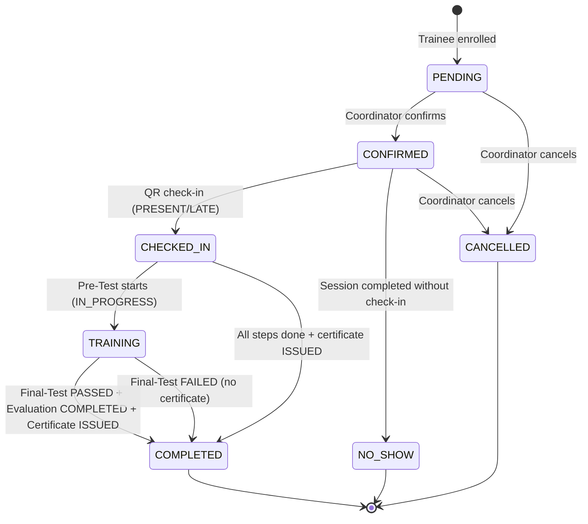

# TrainFlow TMS — SessionEnrollment Lifecycle Diagram

> **Sprint 3.1** — SessionEnrollment as the central workflow entity



## Status Field Transition Matrix

### enrollmentStatus
```
PENDING → CONFIRMED → CHECKED_IN → TRAINING → COMPLETED
                                                    ↘
PENDING → CANCELLED                           NO_SHOW
CONFIRMED → CANCELLED
CONFIRMED → NO_SHOW
```

### attendanceStatus
```
NOT_STARTED → PRESENT  (on QR check-in, on time)
NOT_STARTED → LATE     (on QR check-in, late)
NOT_STARTED → ABSENT   (no check-in by session end)
```

### preTestStatus
```
PENDING → IN_PROGRESS → COMPLETED     (course has pre-test)
NOT_REQUIRED                          (course has no pre-test, or no questions in bank)
```

### finalTestStatus
```
PENDING → IN_PROGRESS → PASSED       (course has final-test, trainee passed)
PENDING → IN_PROGRESS → FAILED       (course has final-test, trainee failed)
NOT_REQUIRED                         (course has no final-test, or no questions in bank)
```

### evaluationStatus
```
PENDING → COMPLETED     (course has evaluation, trainee submitted)
NOT_REQUIRED            (course has no evaluation)
```

### certificateStatus
```
NOT_ELIGIBLE → ELIGIBLE     (attendance PRESENT + final-test PASSED + evaluation COMPLETED)
ELIGIBLE → GENERATED        (certificate record created)
GENERATED → ISSUED          (PDF generated with QR verification)
```

## Pipeline Sync Points

| Trigger | Sync Function | Status Field Updated |
|---------|--------------|---------------------|
| QR check-in | `syncAttendanceCheckedIn()` | `attendanceStatus = PRESENT`, `enrollmentStatus = CHECKED_IN` |
| Pre-Test auto-assigned | `syncPreTestStatus(PENDING)` | `preTestStatus = PENDING` |
| Pre-Test started | `syncPreTestStatus(IN_PROGRESS)` | `preTestStatus = IN_PROGRESS`, `enrollmentStatus = TRAINING` |
| Pre-Test submitted | `syncPreTestStatus(COMPLETED)` | `preTestStatus = COMPLETED` |
| Final-Test auto-assigned | `syncFinalTestStatus(PENDING)` | `finalTestStatus = PENDING` |
| Final-Test started | `syncFinalTestStatus(IN_PROGRESS)` | `finalTestStatus = IN_PROGRESS` |
| Final-Test submitted (passed) | `syncFinalTestStatus(PASSED)` | `finalTestStatus = PASSED` |
| Final-Test submitted (failed) | `syncFinalTestStatus(FAILED)` | `finalTestStatus = FAILED` |
| Evaluation submitted | `syncEvaluationStatus(COMPLETED)` | `evaluationStatus = COMPLETED` |
| After any exam/evaluation | `recalcCertificateEligibility()` | `certificateStatus = ELIGIBLE / NOT_ELIGIBLE` |
| Certificate generated | `syncCertificateStatus(GENERATED)` | `certificateStatus = GENERATED`, `enrollmentStatus = COMPLETED` |
| Certificate PDF issued | `syncCertificateStatus(ISSUED)` | `certificateStatus = ISSUED` |
